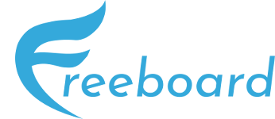

# Backend Example - Freeboard

## Introduction
Freeboard is a project that I am working on, in collaboration with 3 classmates, for school.  
The aim of this project is to create a job posting platform (in the form of a web application) where companies can recruit freelancers for vacancies.

This repository is a partial repository of that used for the backend of Freeboard. Containing only the parts that I created, or have mostly worked on.

## Technologies
Freeboard uses a serverless backend, running completely in Microsoft Azure. This has been done by using [Azure Functions](https://docs.microsoft.com/en-us/azure/azure-functions/functions-overview).  
Other resources used in the backend are:
- [Azure Active Directory B2C](https://docs.microsoft.com/en-us/azure/active-directory-b2c/overview): Used for authentication for Freeboard's users. The Business-To-Customer variant of Azure Active Directory allows for sign up/sign in, using local accounts and social IDs, rather then a Microsoft account.
- [Storage Account](): Used for storing data (e.g. [job postings](BackendExample/Models/Post.cs) and [comments](BackendExample/Models/Comment.cs)) used in the webapp.
- [Key Vault](): Used as a replacement for the Access Tokens provided by Azure Active Directory.